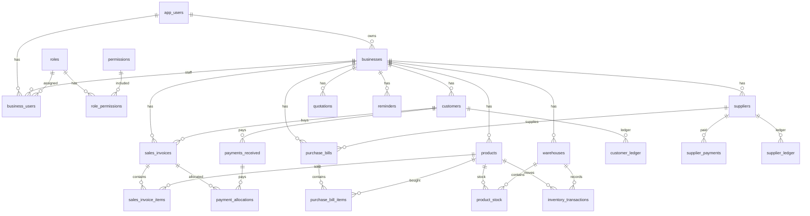

# Smart Khata ERD Overview

```mermaid
erDiagram
  app_users ||--o{ businesses : owns
  app_users ||--o{ business_users : has
  businesses ||--o{ business_users : staff
  roles ||--o{ business_users : assigned
  roles ||--o{ role_permissions : has
  permissions ||--o{ role_permissions : included

  businesses ||--o{ customers : has
  businesses ||--o{ suppliers : has
  businesses ||--o{ products : has
  businesses ||--o{ warehouses : has
  businesses ||--o{ sales_invoices : has
  businesses ||--o{ quotations : has
  businesses ||--o{ purchase_bills : has
  businesses ||--o{ reminders : has

  customers ||--o{ sales_invoices : buys
  customers ||--o{ payments_received : pays
  customers ||--o{ customer_ledger : ledger
  sales_invoices ||--o{ sales_invoice_items : contains
  sales_invoices ||--o{ payment_allocations : allocated
  payments_received ||--o{ payment_allocations : pays

  products ||--o{ sales_invoice_items : sold
  products ||--o{ product_stock : stock
  products ||--o{ inventory_transactions : moves
  warehouses ||--o{ product_stock : contains
  warehouses ||--o{ inventory_transactions : records

  suppliers ||--o{ purchase_bills : supplies
  suppliers ||--o{ supplier_payments : paid
  suppliers ||--o{ supplier_ledger : ledger
  purchase_bills ||--o{ purchase_bill_items : contains
  products ||--o{ purchase_bill_items : bought
```
